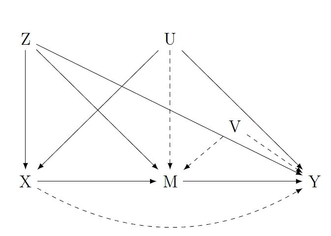

# Unobserved confoundedness in FDC framework

This notebook sheds light on the consequences of violations of the FDC assumptions. In particular, assumptions 2 and 3 are examined.

2. The relationship between X and M is not confounded by unobserved variables.
3. Conditional on X, the relationship between M and Y is not confounded by unobserved variables.

I am going to examine the consequences for the ATE estimated by the FDC as well as by simple back-door adjustment in settings where $M$ is not exogenous (i.e. $U$ also influences $M$ which violates both assumption two and three). In addition, I also elucidate the scenarios where the relationship between treatment $X$ and mediator $M$ as well the relationship between mediator $M$ and outcome $Y$ is confounded by an additional unobserved confounder $V$.

```{r setup, error = FALSE, warning = FALSE, message = FALSE}

knitr::opts_chunk$set(echo = TRUE)
knitr::opts_knit$set(root.dir = "C:/Users/stefan/OneDrive - bwedu/03_semester/Master_Seminar_Marketing/02_empirical/frontdoor_criterion/01_simulations")

# remove scientific notation
options(scipen=999)

rm(list=ls())
invisible(gc())

library(tidyverse)
library(systemfit)
library(latex2exp)

s <- 79
set.seed(s)

n <- 10000

# pvalue function
pval <- function(coef, cv, se, df){
  
  q = (coef-cv) / se
  
  p <- pt(
    q = q,
    df = df,
    lower.tail = !(q > 0)
  )*2
  
  return(p)
  
}

models <- c("benchmark", "naive", "fdc")
len_models <- length(models)

b <- 0.5

```

<center>

</center>

# Simulations

## Unconfounded case

Let
$U_i \sim  \mathcal{N}(0,1)$,
$\epsilon_{X_i}, \epsilon_{Z_i}, \epsilon_{M_i}, \epsilon_{Y_i} \stackrel{i.i.d.}{\sim} \mathcal{N}(0,1)$
for a sample size of N = `r n` observations. Then, let
$$
Z_i = 0.5U_i + \epsilon_{Z_i} \\
X_i = 0.5U_i + 0.5Z_i + \epsilon_{X_i} \\
M_i = 0.5X_i + \epsilon_{M_i} \\
Y_i = 0.5M_i + 0.5Z_i + 0.5U_i + \epsilon_{Y_i}
$$
Note that we also allow for a causal effect of $U$ on $Z$ in this scenario.

```{r unconfounded_simulation, error = FALSE, warning = FALSE, message = FALSE}

replications <- 50

unconfounded <- data.frame(
  rep = NA,
  model = factor(rep(models, replications), levels = models),
  ate = NA,
  first_X = NA,
  second_M = NA
)


for (r in 1:replications){
  
  U <- rnorm(n, mean = 0, sd = 1)
  
  e_X <- rnorm(n, mean = 0, sd = 1)
  e_Z <- rnorm(n, mean = 0, sd = 1)
  e_M <- rnorm(n, mean = 0, sd = 1)
  e_Y <- rnorm(n, mean = 0, sd = 1)
  
  Z <- b*U + e_Z
  X <- b*Z + b*U + e_X
  M <- b*X + b*Z + e_M
  Y <- b*M + b*Z + b*U + e_Y
  
  d <- data.frame(cbind(X, Z, M, Y, U))
  
  bench <- lm(Y ~ X + Z + U, d)
  naive <- lm(Y ~ X + Z, d)
  fdc_model <- systemfit(list(first = M ~ X + Z, second = Y ~ M + X + Z), method = "SUR", data = d)
  
  ate <- as.numeric(fdc_model$coefficients["first_X"] * fdc_model$coefficients["second_M"])
  
  ind <- ((r-1)*len_models+1)
  
  unconfounded[ind:(ind+2),1] <- r
  unconfounded[ind,3] <- bench$coefficients['X']
  unconfounded[ind+1,3] <- naive$coefficients['X']
  unconfounded[ind+2,3] <- ate
  unconfounded[ind+2,4] <- fdc_model$coefficients["first_X"]
  unconfounded[ind+2,5] <- fdc_model$coefficients["second_M"]
  
}

```

### Visualisation

In a setting with (conditional) exogeneity of $M$, the FDC identifies the true causal effect:

```{r unconfounded_visualisation, error = FALSE, warning = FALSE, message = FALSE}

ggplot(unconfounded, aes(x=ate, fill=model)) +
  geom_density(alpha=0.4) +
  geom_vline(xintercept=b^2, color="red") +
  labs(x=TeX(r'($\hat{ATE}$)'), y="Density", fill="Model") +
  xlim(min(unconfounded$ate), max(unconfounded$ate)) +
  theme_bw() +
  scale_fill_manual(values=c("#999999", "#E69F00", "#56B4E9")) +
  theme(plot.title = element_text(hjust = 0.5), plot.caption = element_text(hjust = 0.5))

```

## U confounds M

This changes if we allow for an arrow from $U$ to $M$ (i.e. causal effect of $U$ on $M$).

Let
$U_i \sim  \mathcal{N}(0,1)$,
$\epsilon_{X_i}, \epsilon_{Z_i}, \epsilon_{M_i}, \epsilon_{Y_i} \stackrel{i.i.d.}{\sim} \mathcal{N}(0,1)$
for a sample size of N = `r n` observations.
$\tau$ is the causal effect of $U$ on $M$. I test for different effect sizes of $\tau$ going from -1.5 to 1.5. Then, let
$$
Z_i = 0.5U_i + \epsilon_{Z_i} \\
X_i = 0.5U_i + 0.5Z_i + \epsilon_{X_i} \\
M_i = 0.5X_i + 0.5Z_i + \tau U_i + \epsilon_{M_i} \\
Y_i = 0.5M_i + 0.5Z_i + 0.5U_i + \epsilon_{Y_i}
$$

```{r U_confounds_M_simulation, error = FALSE, warning = FALSE, message = FALSE}

taus <- seq(-1.5, 1.5, 0.025)
len_taus <- length(taus)

replications <- 30

U_confounds_M <- data.frame(
  tau = NA,
  model = factor(rep(models, len_taus), levels = models),
  ate = NA,
  first_X = NA,
  second_M = NA,
  var_X = NA,
  var_M = NA,
  cov_XU = NA,
  cov_MU = NA,
  effect_XU = NA,
  effect_MU = NA,
  effect_UY = NA
  )

for (t in 1:len_taus){
  
  mat_rep <- matrix(NA, ncol = len_models, nrow = replications)
  vec_first_X <- rep(NA, replications)
  vec_second_M <- rep(NA, replications)
  vec_var_X <- rep(NA, replications)
  vec_var_M <- rep(NA, replications)
  vec_cov_XU <- rep(NA, replications)
  vec_cov_MU <- rep(NA, replications)
  vec_effect_XU <- rep(NA, replications)
  vec_effect_MU <- rep(NA, replications)
  vec_effect_UY <- rep(NA, replications)
  
  for (r in 1:replications){
    
    U <- rnorm(n, mean = 0, sd = 1)
    
    e_X <- rnorm(n, mean = 0, sd = 1)
    e_Z <- rnorm(n, mean = 0, sd = 1)
    e_M <- rnorm(n, mean = 0, sd = 1)
    e_Y <- rnorm(n, mean = 0, sd = 1)
    
    Z <- b*U + e_Z
    X <- b*Z + b*U + e_X
    M <- b*X + b*Z + taus[t]*U + e_M
    Y <- b*M + b*Z + b*U + e_Y
    
    d <- data.frame(cbind(X, Z, M, Y, U))
    
    bench <- lm(Y ~ X + Z + U, d)
    naive <- lm(Y ~ X + Z, d)
    fdc_model <- systemfit(list(first = M ~ X + Z, second = Y ~ M + X + Z), method = "SUR", data = d)
    
    ate <- as.numeric(fdc_model$coefficients["first_X"] * fdc_model$coefficients["second_M"])
    
    mat_rep[r,] <- c(bench$coefficients['X'], naive$coefficients['X'], ate)
    vec_first_X[r] <- fdc_model$coefficients["first_X"]
    vec_second_M[r] <- fdc_model$coefficients["second_M"]
    vec_var_X[r] <- var(X)
    vec_var_M[r] <- var(M)
    vec_cov_XU[r] <- cov(X,U)
    vec_cov_MU[r] <- cov(M,U)
    vec_effect_XU[r] <- lm(U ~ X + Z, d)$coefficients["X"]
    vec_effect_MU[r] <- lm(U ~ M + X + Z, d)$coefficients["M"]
    vec_effect_UY[r] <- lm(Y ~ X + Z + U, d)$coefficients["U"]
    
  }
  
  ind <- ((t-1)*len_models+1)
  
  U_confounds_M[ind:(ind+2),1] <- taus[t]
  U_confounds_M[ind:(ind+2),3] <- colMeans(mat_rep)
  U_confounds_M[ind+2,4] <- mean(vec_first_X)
  U_confounds_M[ind+2,5] <-mean(vec_second_M)
  U_confounds_M[ind:(ind+2),6] <- mean(vec_var_X)
  U_confounds_M[ind:(ind+2),7] <- mean(vec_var_M)
  U_confounds_M[ind:(ind+2),8] <- mean(vec_cov_XU)
  U_confounds_M[ind:(ind+2),9] <- mean(vec_cov_MU)
  U_confounds_M[ind:(ind+2),10] <- mean(vec_effect_XU)
  U_confounds_M[ind:(ind+2),11] <- mean(vec_effect_MU)
  U_confounds_M[ind:(ind+2),12] <- mean(vec_effect_UY)
  
}

```

### Visualisation

```{r U_confounds_M_visualisation, error = FALSE, warning = FALSE, message = FALSE}

ggplot(data = U_confounds_M, aes(x = tau, y = ate, colour = model)) +
  geom_point(shape = 16) +
  labs(
    x = TeX(r'($\tau$)'),
    y = TeX(r'($\hat{ATE}$)'),
    title = "ATEs for confounded mediator",
    caption = "Based on simulated data",
    color='Model'
  ) +
  theme_bw() +
  theme(plot.title = element_text(hjust = 0.5), plot.caption = element_text(hjust = 0.5))

```

Let's consider this model more generally by noting the effect sizes with Greek letters:
$$
Z_i = \nu U_i + \epsilon_{Z_i} \\
X_i = \kappa U_i + \alpha Z_i + \epsilon_{X_i} \\
M_i = \gamma X_i + \omega Z_i + \tau U_i + \epsilon_{M_i} \\
Y_i = \pi M_i + \eta Z_i + \upsilon U_i + \epsilon_{Y_i}
$$

What we do estimate using the FDC is the following:
$$
M_i = \hat{\gamma} X_i +  \hat{\omega} Z_i \\
Y_i = \hat{\pi} M_i + \hat{\eta} Z_i + \hat{\theta} X_i
$$

with the $X_i$ being included in the second stage to block the backdoor path from $M_i$ via $U_i$ to $Y_i$. However, this will not be sufficient in this case as there is another backdoor path going directly from $M_i$ to $U_i$ (as long as $\tau$ is different from zero). In addition, the first stage also suffers from an OVB. The $ATE_{FDC}$ is defined as $\gamma \times \pi$. Applying the standard OVB formulas to these variables, one arrives at:
$$
plim \; \hat{\gamma} = \gamma + \tau \frac{\sigma_{X,U}}{\sigma_{X}^2} \\
plim \; \hat{\pi} = \pi + \upsilon \frac{\sigma_{M,U}}{\sigma_{M}^2} \\
plim \; \hat{ATE_{FDC}} = plim \; \hat{\gamma} \times \hat{\pi} = \gamma \pi + \underbrace{\gamma \upsilon \frac{\sigma_{M,U}}{\sigma_{M}^2} + \pi \tau \frac{\sigma_{X,U}}{\sigma_{X}^2} + \tau \upsilon \frac{\sigma_{X,U}}{\sigma_{X}^2} \frac{\sigma_{M,U}}{\sigma_{M}^2}}_{OVB}  \\
$$
with $\sigma_{X,U} = Cov(X^{\perp Z},U^{\perp Z})$, $\sigma_{X}^2 = Var(X^{\perp Z})$, $\sigma_{M,U} = Cov(M^{\perp Z,X},U^{\perp Z,X})$ and  $\sigma_{M}^2 = Var(M^{\perp Z,X})$. $A^{\perp B}$ can be thought of as the residuals from regressing A on B. One basically needs to condition on $Z$ (or $Z,M$ respectively) in this case as the pure covariance of $X$ and $U$ neglects the fact that some of the correlation is driven by $Z$. And as $Z$ is included in both our first and second stage, the covariances in the OVB formulas need to be adjusted for this.

Basically, $\frac{\sigma_{X,U}}{\sigma_{X}^2}$ yields the coefficient of a regression of $X$ and $U$. This is not a causal effect! When conditioning on $Z$, we run this regression using the residuals from regression $Y$, $X$ on $D$. Alternatively, we can also run a regression of $U$ on both $Z$ and $X$ as this is a simple representation of the Frisch-Waugh-Theorem.

Let's turn to our 'naive' estimate of the ATE using simple back-door adjustment by conditioning on $Z$? The equation that we estimate and the associated OVB of our treatment effect can be expressed as follows:
$$
Y_i = \hat{\gamma}\hat{\pi} X_i + \hat{\eta} Z_i = \hat{\xi} X_i + \hat{\eta} Z_i \\
plim \; \hat{\xi} = \gamma \pi + \frac{\sigma_{U,Y}}{\sigma_{U}^2} \frac{\sigma_{X,U}}{\sigma_{X}^2} \\
$$

There are less terms than for the FDC-OVB-formula. Most importantly, one should note that $\frac{\sigma_{U,Y}}{\sigma_{U}^2}$ is not the same as $\upsilon$ as the former also partly leverages the effect of $M$ on $Y$ as we totally ignore $M$ in the naive estimation part. Thus, the total effect of $U$ on $Y$ is not constant in this simulation analysis as it increases with $\tau$.

### Replication of FDC estimate using OVB formula

```{r U_confounds_M_OVB, error = FALSE, warning = FALSE, message = FALSE}

OVB <- U_confounds_M %>%
  filter(model == "fdc") %>%
  rename(ate_fdc = ate) %>%
  mutate(ate = b^2)

OVB$ate_fdc_ovb <- b*b + b*b*OVB$effect_MU + b*OVB$tau*OVB$effect_XU + OVB$tau*b*OVB$effect_XU*OVB$effect_MU

OVB_long <- OVB %>%
  select(ate, ate_fdc, ate_fdc_ovb, tau) %>%
  pivot_longer(c(ate, ate_fdc, ate_fdc_ovb), names_to = "estimator", values_to = "estimate")

ggplot(data = OVB_long, aes(x = tau, y = estimate, color = estimator)) +
  geom_point(shape = 16) +
  labs(
    x = TeX(r'($\tau$)'),
    y = TeX(r'($\hat{ATE}$)'),
    title = "Reconstructed FDC estimate using OVB formulas",
    caption = "Based on simulated data",
    color = "Estimator"
  ) +
  theme_bw() +
  theme(plot.title = element_text(hjust = 0.5), plot.caption = element_text(hjust = 0.5))

```

### Replication of Naive estimate using OVB formula

```{r U_confounds_M_OVB_Naive, error = FALSE, warning = FALSE, message = FALSE}

OVB_naive <- U_confounds_M %>%
  filter(model == "naive") %>%
  rename(ate_naive = ate) %>%
  mutate(ate = b^2) %>%
  select(-first_X, -second_M)

OVB_naive$ate_naive_ovb <- b*b + OVB_naive$effect_UY*OVB_naive$effect_XU
# OVB_naive$ate_naive_ovb <- b*b + OVB_naive$effect_UY_clean*(OVB_naive$effect_XU_clean + OVB_naive$effect_XM*OVB_naive$effect_MU_clean)

OVB_naive_long <- OVB_naive %>%
  select(ate, ate_naive, ate_naive_ovb, tau) %>%
  pivot_longer(c(ate, ate_naive, ate_naive_ovb), names_to = "estimator", values_to = "estimate")

interc_naive <- OVB_naive$ate_naive[OVB_naive$tau == 0]
slope_naive <- mean(OVB_naive$effect_XU)*b  # effect of X on U * (fixed effect of U on Y) -> increases with tau

ggplot(data = OVB_naive_long, aes(x = tau, y = estimate, color = estimator)) +
  geom_point(shape = 16) +
  geom_abline(slope =slope_naive, intercept = interc_naive) +
  labs(
    x = TeX(r'($\tau$)'),
    y = TeX(r'($\hat{ATE}$)'),
    title = "Reconstructed Naive estimate using OVB formulas",
    caption = "Based on simulated data",
    color = "Estimator"
  ) +
  theme_bw() +
  theme(plot.title = element_text(hjust = 0.5), plot.caption = element_text(hjust = 0.5))

```

## Additional unobserved confounder V of M and Y

Let's now move to a case where the effect $\tau$ of U on M is zero. However, there is another additional unobserved confounder $V \sim \mathcal{N}(0,1)$ that violates assumption 3 ("Conditional on X, the relationship between M and Y is not confounded by unobserved variables").

$\phi$ is the causal effect of $V$ on $M$. Once again, I test for different effect sizes of $\phi$ going from -1.5 to 1.5. Then, let
$$
Z_i = 0.5U_i + \epsilon_{Z_i} \\
X_i = 0.5U_i + 0.5Z_i + \epsilon_{X_i} \\
M_i = 0.5X_i + 0.5Z_i + \phi V_i + \epsilon_{M_i} \\
Y_i = 0.5M_i + 0.5Z_i + 0.5U_i + 0.5V_i + \epsilon_{Y_i}
$$

In both settings, I deliberately chose to let the influence of the unobserved confounders vary on $M$ and not on $Y$. There will always be other variables that strongly influence the outcome $Y$, but it ultimately is the strength of the correlation with the independent variable $X$ (or $M$) that determines the magnitude of the underlying OVB. To create a certain degree of comparability, I therefore keep all the effect sizes constant at 0.5.

```{r V_confounds_M_simulation, error = FALSE, warning = FALSE, message = FALSE}

phis <- seq(-1.5, 1.5, 0.025)
len_phis <- length(phis)

V_confounds_M <- data.frame(
  phi = NA,
  model = factor(rep(models, len_phis), levels = models),
  ate = NA,
  first_X = NA,
  second_M = NA,
  var_M = NA,
  cov_MV = NA,
  effect_MV = NA,
  effect_XU = NA
)

for (p in 1:len_phis){
  
  mat_rep <- matrix(NA, ncol = len_models, nrow = replications)
  vec_first_X <- rep(NA, replications)
  vec_second_M <- rep(NA, replications)
  vec_var_M <- rep(NA, replications)
  vec_cov_MV <- rep(NA, replications)
  vec_effect_MV <- rep(NA, replications)
  vec_effect_XU <- rep(NA, replications) 
  
  for (r in 1:replications){
    
    U <- rnorm(n, mean = 0, sd = 1)
    V <- rnorm(n, mean = 0, sd = 1)
    
    e_X <- rnorm(n, mean = 0, sd = 1)
    e_Z <- rnorm(n, mean = 0, sd = 1)
    e_M <- rnorm(n, mean = 0, sd = 1)
    e_Y <- rnorm(n, mean = 0, sd = 1)
    
    Z <- b*U + e_Z
    X <- b*Z + b*U + e_X
    M <- b*X + b*Z + phis[p]*V + e_M
    Y <- b*M + b*Z + b*U + b*V + e_Y
    
    d <- data.frame(cbind(X, Z, M, Y, U, V))
    
    bench <- lm(Y ~ X + Z + U + V, d)
    naive <- lm(Y ~ X + Z, d)
    fdc_model <- systemfit(list(first = M ~ X + Z, second = Y ~ M + X + Z), method = "SUR", data = d)
    
    ate <- as.numeric(fdc_model$coefficients["first_X"] * fdc_model$coefficients["second_M"])
    
    mat_rep[r,] <- c(bench$coefficients['X'], naive$coefficients['X'], ate)
    vec_first_X[r] <- fdc_model$coefficients["first_X"]
    vec_second_M[r] <- fdc_model$coefficients["second_M"]
    vec_var_M[r] <- var(M)
    vec_cov_MV[r] <- cov(M,V)
    vec_effect_MV[r] <- lm(V ~ M + Z + X, d)$coefficients["M"]
    vec_effect_XU[r] <- lm(U ~ X + Z, d)$coefficients["X"]
    
  }
  
  ind <- ((p-1)*len_models+1)
  
  V_confounds_M[ind:(ind+2),1] <- phis[p]
  V_confounds_M[ind:(ind+2),3] <- colMeans(mat_rep)
  V_confounds_M[ind+2,4] <- mean(vec_first_X)
  V_confounds_M[ind+2,5] <-mean(vec_second_M)
  V_confounds_M[ind:(ind+2),6] <- mean(vec_var_M)
  V_confounds_M[ind:(ind+2),7] <- mean(vec_cov_MV)
  V_confounds_M[ind:(ind+2),8] <- mean(vec_effect_MV)
  V_confounds_M[ind:(ind+2),9] <- mean(vec_effect_XU)
  
}

```

### Visualisation

```{r V_confounds_M_visualisation, error = FALSE, warning = FALSE, message = FALSE}

ggplot(data = V_confounds_M, aes(x = phi, y = ate, colour = model)) +
  geom_point(shape = 16) +
  labs(
    x = TeX(r'($\phi$)'),
    y = TeX(r'($\hat{ATE}$)'),
    title = "ATEs for confounded mediator",
    caption = "Based on simulated data",
    color='Model'
  ) +
  theme_bw() +
  theme(plot.title = element_text(hjust = 0.5), plot.caption = element_text(hjust = 0.5))

```

Let's consider this model more generally by noting the effect sizes with Greek letters:
$$
Z_i = \nu U_i + \epsilon_{Z_i} \\
X_i = \kappa U_i + \alpha Z_i + \epsilon_{X_i} \\
M_i = \gamma X_i + \omega Z_i + \phi V_i + \epsilon_{M_i} \\
Y_i = \pi M_i + \eta Z_i + \upsilon U_i + \psi V_i + \epsilon_{Y_i}
$$

What we do estimate using the FDC is the following:
$$
M_i = \hat{\gamma} X_i +  \hat{\omega} Z_i \\
Y_i = \hat{\pi} M_i + \hat{\eta} Z_i + \hat{\theta} X_i
$$

In this scenario, the first stage yields unbiased and consistent estimates $\gamma$ and $\omega$ as $X$ and $Z$ are both uncorrelated to the unobserved confounder $V$.
The second stage, however, suffers from the following OVB:
$$
plim \; \hat{\gamma} = \gamma \\
plim \; \hat{\pi} = \pi + \psi \frac{\sigma_{M,V}}{\sigma_{V}^2} \\
plim \; \hat{ATE_{FDC}} = plim \; \hat{\gamma} \times \hat{\pi} = \gamma \pi + \gamma \psi \frac{\sigma_{M,V}}{\sigma_{M}^2} \\
$$

### Replication of FDC estimate using OVB formula

```{r V_confounds_M_OVB, error = FALSE, warning = FALSE, message = FALSE}

OVB_V <- V_confounds_M %>%
  filter(model == "fdc") %>%
  rename(ate_fdc = ate) %>%
  mutate(ate = b^2)

OVB_V$ate_fdc_ovb <- b*b + b*b*OVB_V$effect_MV
# OVB_V$ate_fdc_ovb <- b*b + b*b*(OVB_V$cov_MV/OVB_V$var_M)


OVB_V_long <- OVB_V %>%
  select(ate, ate_fdc, ate_fdc_ovb, phi) %>%
  pivot_longer(c(ate, ate_fdc, ate_fdc_ovb), names_to = "estimator", values_to = "estimate")

ggplot(data = OVB_V_long, aes(x = phi, y = estimate, color = estimator)) +
  geom_point(shape = 16) +
  labs(
    x = TeX(r'($\phi$)'),
    y = TeX(r'($\hat{ATE}$)'),
    title = "Reconstructed FDC estimate using OVB formulas",
    caption = "Based on simulated data",
    color = "Estimator"
  ) +
  theme_bw() +
  theme(plot.title = element_text(hjust = 0.5), plot.caption = element_text(hjust = 0.5))

```

### Replication of Naive estimate using OVB formula

```{r U_confounds_V_OVB_Naive, error = FALSE, warning = FALSE, message = FALSE}

OVB_V_naive <- V_confounds_M %>%
  filter(model == "naive") %>%
  rename(ate_naive = ate) %>%
  mutate(ate = b^2) %>%
  select(-first_X, -second_M)

OVB_V_naive$ate_naive_ovb <- b*b + b*OVB_V_naive$effect_XU

OVB_V_naive_long <- OVB_V_naive %>%
  select(ate, ate_naive, ate_naive_ovb, phi) %>%
  pivot_longer(c(ate, ate_naive, ate_naive_ovb), names_to = "estimator", values_to = "estimate")

ggplot(data = OVB_V_naive_long, aes(x = phi, y = estimate, color = estimator)) +
  geom_point(shape = 16) +
  labs(
    x = TeX(r'($\tau$)'),
    y = TeX(r'($\hat{ATE}$)'),
    title = "Reconstructed Naive estimate using OVB formulas",
    caption = "Based on simulated data",
    color = "Estimator"
  ) +
  theme_bw() +
  theme(plot.title = element_text(hjust = 0.5), plot.caption = element_text(hjust = 0.5))

```

## Additional unobserved confounder V of M and Y - Reverse

Let's now vary the effect $\phi$ of $V$ on $Y$ rather on $M$. Then, let
$$
Z_i = 0.5U_i + \epsilon_{Z_i} \\
X_i = 0.5U_i + 0.5Z_i + \epsilon_{X_i} \\
M_i = 0.5X_i + 0.5Z_i + 0.5V_i + \epsilon_{M_i} \\
Y_i = 0.5M_i + 0.5Z_i + 0.5U_i + \phi V_i + \epsilon_{Y_i}
$$

```{r V_confounds_M_simulation_2, error = FALSE, warning = FALSE, message = FALSE}

V_confounds_M_2 <- data.frame(
  phi = NA,
  model = factor(rep(models, len_phis), levels = models),
  ate = NA,
  first_X = NA,
  second_M = NA,
  var_M = NA,
  cov_MV = NA,
  effect_MV = NA,
  effect_XU = NA
)

for (p in 1:len_phis){
  
  mat_rep <- matrix(NA, ncol = len_models, nrow = replications)
  vec_first_X <- rep(NA, replications)
  vec_second_M <- rep(NA, replications)
  vec_var_M <- rep(NA, replications)
  vec_cov_MV <- rep(NA, replications)
  vec_effect_MV <- rep(NA, replications)
  vec_effect_XU <- rep(NA, replications) 
  
  for (r in 1:replications){
    
    U <- rnorm(n, mean = 0, sd = 1)
    V <- rnorm(n, mean = 0, sd = 1)
    
    e_X <- rnorm(n, mean = 0, sd = 1)
    e_Z <- rnorm(n, mean = 0, sd = 1)
    e_M <- rnorm(n, mean = 0, sd = 1)
    e_Y <- rnorm(n, mean = 0, sd = 1)
    
    Z <- b*U + e_Z
    X <- b*Z + b*U + e_X
    M <- b*X + b*Z + b*V + e_M
    Y <- b*M + b*Z + b*U + phis[p]*V + e_Y
    
    d <- data.frame(cbind(X, Z, M, Y, U, V))
    
    bench <- lm(Y ~ X + Z + U + V, d)
    naive <- lm(Y ~ X + Z, d)
    fdc_model <- systemfit(list(first = M ~ X + Z, second = Y ~ M + X + Z), method = "SUR", data = d)
    
    ate <- as.numeric(fdc_model$coefficients["first_X"] * fdc_model$coefficients["second_M"])
    
    mat_rep[r,] <- c(bench$coefficients['X'], naive$coefficients['X'], ate)
    vec_first_X[r] <- fdc_model$coefficients["first_X"]
    vec_second_M[r] <- fdc_model$coefficients["second_M"]
    vec_var_M[r] <- var(M)
    vec_cov_MV[r] <- cov(M,V)
    vec_effect_MV[r] <- lm(V ~ M + Z + X, d)$coefficients["M"]
    vec_effect_XU[r] <- lm(U ~ X + Z, d)$coefficients["X"]
    
  }
  
  ind <- ((p-1)*len_models+1)
  
  V_confounds_M_2[ind:(ind+2),1] <- phis[p]
  V_confounds_M_2[ind:(ind+2),3] <- colMeans(mat_rep)
  V_confounds_M_2[ind+2,4] <- mean(vec_first_X)
  V_confounds_M_2[ind+2,5] <-mean(vec_second_M)
  V_confounds_M_2[ind:(ind+2),6] <- mean(vec_var_M)
  V_confounds_M_2[ind:(ind+2),7] <- mean(vec_cov_MV)
  V_confounds_M_2[ind:(ind+2),8] <- mean(vec_effect_MV)
  V_confounds_M_2[ind:(ind+2),9] <- mean(vec_effect_XU)
  
}

```

### Visualisation

The pattern changes. For large effect sizes of $\phi$, the FDC-OVB is larger than its naive counterpart. Moreover, the OVB increases linearly with $\phi$ by the factor $\gamma \frac{\sigma_{M,V}}{\sigma_{M}^2}$ (which is a constant) in this scenario.

```{r V_confounds_M_visualisation_2, error = FALSE, warning = FALSE, message = FALSE}

ggplot(data = V_confounds_M_2, aes(x = phi, y = ate, colour = model)) +
  geom_point(shape = 16) +
  labs(
    x = TeX(r'($\phi$)'),
    y = TeX(r'($\hat{ATE}$)'),
    title = "ATEs for confounded mediator",
    caption = "Based on simulated data",
    color='Model'
  ) +
  theme_bw() +
  theme(plot.title = element_text(hjust = 0.5), plot.caption = element_text(hjust = 0.5))

```

The factor can easily be derived from the corresponding OVB formula:
$$
plim \; \hat{\gamma} = \gamma \\
plim \; \hat{\pi} = \pi + \phi \frac{\sigma_{M,V}}{\sigma_{V}^2} \\
plim \; \hat{ATE_{FDC}} = plim \; \hat{\gamma} \times \hat{\pi} = \gamma \pi + \gamma \phi \frac{\sigma_{M,V}}{\sigma_{M}^2} \\
$$

### Replication of FDC estimate using OVB formula

```{r V_confounds_M_OVB_2, error = FALSE, warning = FALSE, message = FALSE}

OVB_V_2 <- V_confounds_M_2 %>%
  filter(model == "fdc") %>%
  rename(ate_fdc = ate) %>%
  mutate(ate = b^2)

OVB_V_2$ate_fdc_ovb <- b*b + b*OVB_V_2$effect_MV*OVB_V_2$phi


OVB_V_2_long <- OVB_V_2 %>%
  select(ate, ate_fdc, ate_fdc_ovb, phi) %>%
  pivot_longer(c(ate, ate_fdc, ate_fdc_ovb), names_to = "estimator", values_to = "estimate")

ggplot(data = OVB_V_2_long, aes(x = phi, y = estimate, color = estimator)) +
  geom_point(shape = 16) +
  labs(
    x = TeX(r'($\phi$)'),
    y = TeX(r'($\hat{ATE}$)'),
    title = "Reconstructed FDC estimate using OVB formulas",
    caption = "Based on simulated data",
    color = "Estimator"
  ) +
  theme_bw() +
  theme(plot.title = element_text(hjust = 0.5), plot.caption = element_text(hjust = 0.5))

```

## Additional unobserved confounder V of X and M

Let's now move to another where not the relationship of $M$ and $X$ but the one of $X$ and $M$ is confounded. Let's denote this unobserved confounder as $W \sim \mathcal{N}(0,1)$ which constitutes a violation of assumption 2 ("The relationship between X and M is not confounded by unobserved variables.").

$\chi$ is the causal effect of $W$ on $M$. Let
$$
Z_i = 0.5U_i + \epsilon_{Z_i} \\
X_i = 0.5U_i + 0.5Z_i + 0.5W_i + \epsilon_{X_i} \\
M_i = 0.5X_i + 0.5Z_i + \chi W_i + \epsilon_{M_i} \\
Y_i = 0.5M_i + 0.5Z_i + 0.5U_i + \epsilon_{Y_i}
$$

```{r W_confounds_M_simulation, error = FALSE, warning = FALSE, message = FALSE}

chis <- seq(-1.5, 1.5, 0.025)
len_chis <- length(chis)

W_confounds_M <- data.frame(
  chi = NA,
  model = factor(rep(models, len_chis), levels = models),
  ate = NA,
  first_X = NA,
  second_M = NA,
  var_X = NA,
  cov_XW = NA,
  effect_XW = NA
)

for (c in 1:len_chis){
  
  mat_rep <- matrix(NA, ncol = len_models, nrow = replications)
  vec_first_X <- rep(NA, replications)
  vec_second_M <- rep(NA, replications)
  vec_var_X <- rep(NA, replications)
  vec_cov_XW <- rep(NA, replications)
  vec_effect_XW <- rep(NA, replications)
  
  for (r in 1:replications){
    
    U <- rnorm(n, mean = 0, sd = 1)
    W <- rnorm(n, mean = 0, sd = 1)
    
    e_X <- rnorm(n, mean = 0, sd = 1)
    e_Z <- rnorm(n, mean = 0, sd = 1)
    e_M <- rnorm(n, mean = 0, sd = 1)
    e_Y <- rnorm(n, mean = 0, sd = 1)
    
    Z <- b*U + e_Z
    X <- b*Z + b*U + b*W + e_X
    M <- b*X + b*Z + chis[c]*W + e_M
    Y <- b*M + b*Z + b*U + e_Y
    
    d <- data.frame(cbind(X, Z, M, Y, U, W))
    
    bench <- lm(Y ~ X + Z + U + W, d)
    naive <- lm(Y ~ X + Z, d)
    fdc_model <- systemfit(list(first = M ~ X + Z, second = Y ~ M + X + Z), method = "SUR", data = d)
    
    ate <- as.numeric(fdc_model$coefficients["first_X"] * fdc_model$coefficients["second_M"])
    
    mat_rep[r,] <- c(bench$coefficients['X'], naive$coefficients['X'], ate)
    vec_first_X[r] <- fdc_model$coefficients["first_X"]
    vec_second_M[r] <- fdc_model$coefficients["second_M"]
    vec_var_X[r] <- var(X)
    vec_cov_XW[r] <- cov(X,W)
    vec_effect_XW[r] <- lm(W ~ X + Z, d)$coefficients["X"]
    
  }
  
  ind <- ((c-1)*len_models+1)
  
  W_confounds_M[ind:(ind+2),1] <- chis[c]
  W_confounds_M[ind:(ind+2),3] <- colMeans(mat_rep)
  W_confounds_M[ind+2,4] <- mean(vec_first_X)
  W_confounds_M[ind+2,5] <-mean(vec_second_M)
  W_confounds_M[ind:(ind+2),6] <- mean(vec_var_X)
  W_confounds_M[ind:(ind+2),7] <- mean(vec_cov_XW)
  W_confounds_M[ind:(ind+2),8] <- mean(vec_effect_XW)
  
}

```

### Visualisation

```{r W_confounds_M_visualisation, error = FALSE, warning = FALSE, message = FALSE}

ggplot(data = W_confounds_M, aes(x = chi, y = ate, colour = model)) +
  geom_point(shape = 16) +
  labs(
    x = TeX(r'($\chi$)'),
    y = TeX(r'($\hat{ATE}$)'),
    title = "ATEs for confounded mediator",
    caption = "Based on simulated data",
    color='Model'
  ) +
  theme_bw() +
  theme(plot.title = element_text(hjust = 0.5), plot.caption = element_text(hjust = 0.5))

```

Let's consider this model more generally by noting the effect sizes with Greek letters:
$$
Z_i = \nu U_i + \epsilon_{Z_i} \\
X_i = \kappa U_i + \alpha Z_i + \zeta W_i + \epsilon_{X_i} \\
M_i = \gamma X_i + \omega Z_i + \chi W_i + \epsilon_{M_i} \\
Y_i = \pi M_i + \eta Z_i + \upsilon U_i + \epsilon_{Y_i}
$$

What we do estimate using the FDC is the following:
$$
M_i = \hat{\gamma} X_i +  \hat{\omega} Z_i \\
Y_i = \hat{\pi} M_i + \hat{\eta} Z_i + \hat{\theta} X_i
$$

Differently to the previous scenario with $V$, we cannot totally neglect the other (non-confounded) stage as it suffers from a collider bias. Namely, $X$ is a non-collider on the back-door path ($M$ <- $X$ (<- $Z$) <- $U$ -> $Y$). This is why we should condition it. At the same time, $X$ is a collider on the back-door path ($M$ <- $W$ -> $X$ (<- $Z$) <- $U$ -> $Y$). Hence, we do not know whether we should or should not condition on variable $X$ in the second stage. Thus, the second stage also suffers from an OVB this scenario. However, I refrain from defining it explicitly here.

More importantly, the first stage suffers from the following OVB:
$$
plim \; \hat{\gamma} = \gamma  + \chi \frac{\sigma_{X,W}}{\sigma_{W}^2} \\
plim \; \hat{ATE_{FDC}} = plim \; \hat{\gamma} \times \hat{\pi} = \gamma \hat{\pi} + \hat{\pi} \chi \frac{\sigma_{X,W}}{\sigma_{X}^2} \\
$$

### Replication of FDC estimate using OVB formula

```{r W_confounds_M_OVB, error = FALSE, warning = FALSE, message = FALSE}

OVB_W <- W_confounds_M %>%
  filter(model == "fdc") %>%
  rename(ate_fdc = ate) %>%
  mutate(ate = b^2)

OVB_W$ate_fdc_ovb <- b*OVB_W$second_M + OVB_W$second_M*OVB_W$chi*OVB_W$effect_XW


OVB_W_long <- OVB_W %>%
  select(ate, ate_fdc, ate_fdc_ovb, chi) %>%
  pivot_longer(c(ate, ate_fdc, ate_fdc_ovb), names_to = "estimator", values_to = "estimate")

ggplot(data = OVB_W_long, aes(x = chi, y = estimate, color = estimator)) +
  geom_point(shape = 16) +
  labs(
    x = TeX(r'($\chi$)'),
    y = TeX(r'($\hat{ATE}$)'),
    title = "Reconstructed FDC estimate using OVB formulas",
    caption = "Based on simulated data",
    color = "Estimator"
  ) +
  theme_bw() +
  theme(plot.title = element_text(hjust = 0.5), plot.caption = element_text(hjust = 0.5))

```

## Additional unobserved confounder V of X and M - Reverse

Let's once again change the variable that is affected by our varying effect. Let's define $\zeta$ now as as the effect of $W$ on $X$ and keep the effect $\chi$ of $W$ on $M$ constant:
$$
Z_i = 0.5U_i + \epsilon_{Z_i} \\
X_i = 0.5U_i + 0.5Z_i + \chi W_i + \epsilon_{X_i} \\
M_i = 0.5X_i + 0.5Z_i + 0.5W_i + \epsilon_{M_i} \\
Y_i = 0.5M_i + 0.5Z_i + 0.5U_i + \epsilon_{Y_i}
$$

```{r W_confounds_M_simulation_2, error = FALSE, warning = FALSE, message = FALSE}

W_confounds_M_2 <- data.frame(
  chi = NA,
  model = factor(rep(models, len_chis), levels = models),
  ate = NA,
  first_X = NA,
  second_M = NA,
  var_X = NA,
  cov_XW = NA,
  effect_XW = NA
)

for (c in 1:len_chis){
  
  mat_rep <- matrix(NA, ncol = len_models, nrow = replications)
  vec_first_X <- rep(NA, replications)
  vec_second_M <- rep(NA, replications)
  vec_var_X <- rep(NA, replications)
  vec_cov_XW <- rep(NA, replications)
  vec_effect_XW <- rep(NA, replications)
  
  for (r in 1:replications){
    
    U <- rnorm(n, mean = 0, sd = 1)
    W <- rnorm(n, mean = 0, sd = 1)
    
    e_X <- rnorm(n, mean = 0, sd = 1)
    e_Z <- rnorm(n, mean = 0, sd = 1)
    e_M <- rnorm(n, mean = 0, sd = 1)
    e_Y <- rnorm(n, mean = 0, sd = 1)
    
    Z <- b*U + e_Z
    X <- b*Z + b*U + chis[c]*W + e_X
    M <- b*X + b*Z + b*W + e_M
    Y <- b*M + b*Z + b*U + e_Y
    
    d <- data.frame(cbind(X, Z, M, Y, U, W))
    
    bench <- lm(Y ~ X + Z + U + W, d)
    naive <- lm(Y ~ X + Z, d)
    fdc_model <- systemfit(list(first = M ~ X + Z, second = Y ~ M + X + Z), method = "SUR", data = d)
    
    ate <- as.numeric(fdc_model$coefficients["first_X"] * fdc_model$coefficients["second_M"])
    
    mat_rep[r,] <- c(bench$coefficients['X'], naive$coefficients['X'], ate)
    vec_first_X[r] <- fdc_model$coefficients["first_X"]
    vec_second_M[r] <- fdc_model$coefficients["second_M"]
    vec_var_X[r] <- var(X)
    vec_cov_XW[r] <- cov(X,W)
    vec_effect_XW[r] <- lm(W ~ X + Z)$coefficients["X"]
    
  }
  
  ind <- ((c-1)*len_models+1)
  
  W_confounds_M_2[ind:(ind+2),1] <- chis[c]
  W_confounds_M_2[ind:(ind+2),3] <- colMeans(mat_rep)
  W_confounds_M_2[ind+2,4] <- mean(vec_first_X)
  W_confounds_M_2[ind+2,5] <-mean(vec_second_M)
  W_confounds_M_2[ind:(ind+2),6] <- mean(vec_var_X)
  W_confounds_M_2[ind:(ind+2),7] <- mean(vec_cov_XW)
  W_confounds_M_2[ind:(ind+2),8] <- mean(vec_effect_XW)
  
}

```

### Visualisation

```{r W_confounds_M_visualisation_2, error = FALSE, warning = FALSE, message = FALSE}

ggplot(data = W_confounds_M_2, aes(x = chi, y = ate, colour = model)) +
  geom_point(shape = 16) +
  labs(
    x = TeX(r'($\chi$)'),
    y = TeX(r'($\hat{ATE}$)'),
    title = "ATEs for confounded mediator",
    caption = "Based on simulated data",
    color='Model'
  ) +
  theme_bw() +
  theme(plot.title = element_text(hjust = 0.5), plot.caption = element_text(hjust = 0.5))

```

The FDC estimate can then be expressed with the following OVB (with $\zeta$ being the causal effect of $W$ on $M$):
$$
plim \; \hat{\gamma} = \gamma  + \zeta \frac{\sigma_{X,W}}{\sigma_{W}^2} \\
plim \; \hat{ATE_{FDC}} = plim \; \hat{\gamma} \times \hat{\pi} = \gamma \hat{\pi} + \hat{\pi} \zeta \frac{\sigma_{X,W}}{\sigma_{X}^2} \\
$$

### Replication of FDC estimate using OVB formula

```{r W_confounds_M_OVB_2, error = FALSE, warning = FALSE, message = FALSE}

OVB_W_2 <- W_confounds_M_2 %>%
  filter(model == "fdc") %>%
  rename(ate_fdc = ate) %>%
  mutate(ate = b^2)

OVB_W_2$ate_fdc_ovb <- b*OVB_W_2$second_M + OVB_W_2$second_M*b*OVB_W_2$effect_XW


OVB_W_2_long <- OVB_W_2 %>%
  select(ate, ate_fdc, ate_fdc_ovb, chi) %>%
  pivot_longer(c(ate, ate_fdc, ate_fdc_ovb), names_to = "estimator", values_to = "estimate")

ggplot(data = OVB_W_2_long, aes(x = chi, y = estimate, color = estimator)) +
  geom_point(shape = 16) +
  labs(
    x = TeX(r'($\chi$)'),
    y = TeX(r'($\hat{ATE}$)'),
    title = "Reconstructed FDC estimate using OVB formulas",
    caption = "Based on simulated data",
    color = "Estimator"
  ) +
  theme_bw() +
  theme(plot.title = element_text(hjust = 0.5), plot.caption = element_text(hjust = 0.5))

```
